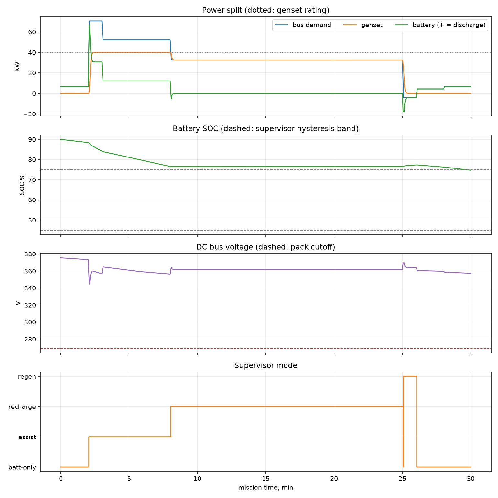
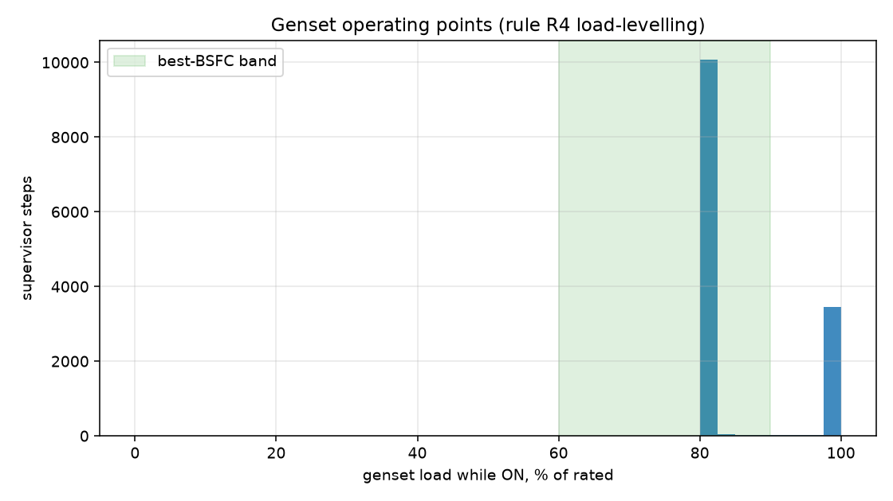
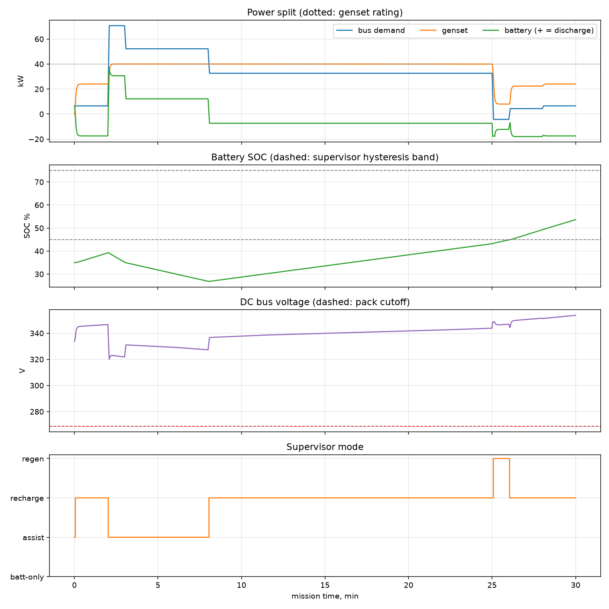

# Series-Hybrid Powertrain — Energy Management Controller (Simulink/Simscape)

A system-level Simulink/Simscape model of a **series-hybrid electric powertrain**
(turbogenerator + Li-ion battery + electric drive on a common DC bus) with a
**rule-based supervisory power-split controller**, plus an independent Python
co-simulation used to verify the controller logic and mission feasibility.

This is **Project 5** of my EE hardware portfolio and is designed as the
*system integration* layer over the other projects:

| Portfolio project | What it contributes here | Status in this repo |
|---|---|---|
| Project 3 — Battery SOC estimator (coulomb counting vs. EKF, 18650 cell) | Cell OCV(SOC) table, ohmic resistance R0, usable capacity; the SOC signal chain | **Stand-in values** (see below) |
| Project 4 — Three-phase inverter + PMSM FOC (Simscape) | Drive ratings and efficiency; justification for the averaged drive model | **Stand-in values** (see below) |

> ## ⚠️ Parameter provenance — stand-ins in use
> The characterized data from Projects 3 and 4 was **not reachable from the
> environment this project was built in**, so every parameter tagged
> `[STAND-IN]` in `matlab/hybrid_params.m` (and mirrored in
> `validation/simulate_hybrid.py`) is a **representative public value** —
> 18650 cell figures of a Samsung INR18650-25R-class power cell from public
> datasheets, a textbook-typical NMC OCV curve, and generic drive/genset
> efficiencies. They are *plausible*, not *measured*. The interfaces are
> built so the real data drops in with no structural changes:
> replace the tagged fields in `hybrid_params.m` and re-run.
>
> All engineering here is original, public-knowledge work. It contains no
> material related to any employer or internal program, and does not
> represent any specific aircraft or product.

---

## Repository layout

```
matlab/
  hybrid_params.m           single source of truth for ALL parameters
  mission_profile.m         30-min flight-shaped shaft-power demand
  power_split_controller.m  supervisory controller (rules R1-R6) - also the
                            MATLAB Function block source in the model
  drive_interface.m         averaged drive model (shaft W -> DC bus W)
  build_hybrid_model.m      programmatic construction of the .slx model
  run_hybrid_sim.m          top-level: build -> simulate -> check -> plot
  plot_results.m            4-panel mission plot (mirrors the Python plots)
validation/
  simulate_hybrid.py        independent port of plant + controller, with
                            9 feasibility checks x 2 scenarios (CI-runnable)
  requirements.txt
results/
  mission_python.png        nominal mission (committed, generated)
  mission_python_lowsoc.png low-SOC-start recovery scenario
  genset_histogram.png      genset operating points vs. best-BSFC band
```

**Run (MATLAB R2023b+, Simulink + Simscape + Simscape Electrical + Stateflow):**

```matlab
cd matlab
run_hybrid_sim      % builds hybrid_powertrain_ems.slx if absent, simulates,
                    % asserts feasibility, saves results/mission_matlab.png
```

**Run (no MATLAB needed):**

```bash
cd validation
pip install -r requirements.txt
python3 simulate_hybrid.py    # exit code 0 iff all 18 checks pass
```

---

## Architecture

```
                 ┌─────────────────────────────────────────────┐
                 │        SUPERVISOR (rule-based, Ts = 0.1 s)   │
                 │  in:  P_dem_elec, SOC, P_gen_measured        │
                 │  out: P_gen_cmd (slew-limited), mode,        │
                 │       P_unmet / P_dump accounting            │
                 └───────┬──────────────────────▲───────▲───────┘
                         │ P_gen_cmd            │ SOC   │ P_gen_meas
                         ▼                      │       │
   mission        ┌────────────┐        coulomb counter │
   P_shaft ──────▶│  genset    │        on I_batt       │
      │           │ lag τ=3 s  │──────────────────────┐ │
      ▼           └─────┬──────┘                      │ │
 ┌──────────┐           │ P_gen                       │ │
 │ drive    │           ▼                             │ │
 │ η=0.92   │   ══════ DC BUS (≈345 V) ══════╦════════╪═╪══
 │ (avgd    │           ▲                    ║        │
 │ Project4)│───────────┘ P_load             ║        │
 └──────────┘                          OCV(SOC)+R0    │
                                       Thevenin pack ─┘
                                       (96s15p 18650, ~13 kWh,
                                        Project 3 model structure)
```

- **Genset** (turbine + PM generator + rectifier, abstracted): controlled
  power source with a 3 s first-order lag; the supervisor owns the 5 kW/s
  slew constraint. Rated 40 kW, minimum stable load 8 kW, best-BSFC band
  60–90 % of rating.
- **Battery**: OCV(SOC) + R0 Thevenin pack built from Foundation-library
  blocks (controlled voltage source + resistor + lookup table).
- **Drive**: averaged power port, η = 0.92 motoring / 0.85 regen, 70 kW peak
  clamp.
- **Battery is the slack node**: the supervisor actuates *only* the genset;
  the bus physics make the battery absorb whatever remains. The controller
  predicts that remainder, checks it against limits, and reports any
  violation as `P_unmet` (demand not met) or `P_dump` (regen to a brake
  resistor) rather than hiding it.

### Controller rule set (R1–R6)

| Rule | What it does |
|---|---|
| R1 | Battery power limits, linearly tapered to zero over the last 5 % at each SOC rail |
| R2 | Genset ON if SOC < 45 % **or** demand > 40 kW; OFF only if SOC > 75 % **and** demand < genset minimum stable load; 60 s minimum on/off dwell |
| R3 | When ON: command = demand + charge bias `k·(SOC_target − SOC)`, clamped to [P_min, P_rated] |
| R4 | If R3 lands below the best-BSFC band and the battery can absorb the surplus, raise the command to the bottom of the band (load-levelling) |
| R5 | 5 kW/s slew limit on the command (turbine spool), applied *in the controller* |
| R6 | Battery power accounting against **measured** genset power; residuals reported as `P_unmet` / `P_dump` |

---

## Non-obvious design decisions

**1. Series (not parallel) hybrid.** A series topology fully decouples the
heat engine from the propulsor: the genset never sees shaft-speed
transients, so it can be held in its best-BSFC band — which is exactly what
the supervisor exploits (R4). It is also the only topology in which the
whole powertrain reduces to one DC bus, which is what lets this project
reuse the portfolio's battery model and electric drive directly.

**2. Rule-based supervisor, not ECMS/DP/MPC.** With two sources on one bus
and a genset with a distinct efficiency band, near-optimal behavior is
achievable with inspectable rules: cover the load, bias toward an SOC
target, keep the genset in its band, respect limits. A rule-based law is
deterministic, trivially bounded in execution time, and every transition
can be traced to a requirement — the qualities that matter first in any
safety-adjacent power system. It also provides the baseline an optimizing
strategy must beat (see interview Q1).

**3. Model fidelity ladder.** Project 4's FOC model is switching-level
(µs time steps); a 30-minute energy study at that fidelity is millions of
times more computation than needed, and none of the switching detail
changes *energy* outcomes. So the drive appears here as an averaged power
port with a fixed efficiency and a peak-power clamp. The upgrade path is a
torque×speed efficiency map in `drive_interface.m` — a 2-D lookup replacing
two constants — not a re-integration of the switching model.

**4. Thevenin OCV+R0 battery, on purpose.** The pack is deliberately the
*same model structure Project 3's EKF assumes* (OCV lookup + ohmic drop),
built from Foundation blocks rather than a vendor battery block. Two
reasons: (a) the integration claim is real — Project 3's fitted OCV table
and R0 land in `hybrid_params.m` untouched; (b) SOC feedback to the
supervisor is **coulomb-counted from bus current**, which is exactly the
signal chain Project 3's estimator would replace — so the estimator's
role in the system is visible, not abstracted away. RC polarization pairs
are omitted: on supervisor timescales (0.1 s decisions, minute-scale
segments) the ohmic term dominates the bus-voltage behavior the study
cares about (see interview Q2 for when this breaks).

**5. The model is committed as a build script, not a binary .slx.**
`build_hybrid_model.m` constructs the model programmatically; the `.slx`
itself is git-ignored. Every block, parameter, and connection is
reviewable in a text diff, and the MATLAB Function blocks load their code
from the same `.m` files that are version-controlled — there is no second
copy of the controller living inside a binary. (Trade-off: Simscape
port-index conventions drift slightly between releases; the script header
says what to do if an `add_line` errors on a different release.)

**6. Genset rated 40 kW because of a failed check, not a guess.** The
first sizing (35 kW) passed the power-balance arithmetic but the
co-simulation's operating-point histogram showed the unit pinned at
93–100 % of rating for the entire cruise — 1 % of ON-time in its
best-BSFC band. Rating the genset so that *cruise demand + charge margin*
sits inside the band (33 kW ≈ 81 % of 40 kW) raised band occupancy to
74 %. The general rule: in a series hybrid, the genset is sized by the
*sustained* operating point and the band, and the battery is sized by the
transients — not the other way around.

**7. Feasibility accounting runs on measured genset power (R6).** The
first implementation accounted against the *command* and breached the
battery charge limit by ~50 % during the cruise→descent transition: with
a 5 kW/s slew and a 3 s lag, actual genset output trails the command by up
to `rate × τ ≈ 15 kW`, and all of that mismatch lands in the battery
(slack node). Feeding measured power back into the supervisor fixed it —
and it is the physically honest choice, since a real EMS would use
telemetry. This bug was found by the automated charge-limit check, which
is the argument for having such checks at all.

**8. The genset-OFF rule requires demand below *minimum stable load*, not
just healthy SOC.** An earlier draft turned the genset off whenever
SOC > 75 % and the battery could cover the load. Analysis of the cruise
segment showed that rule is a trap: at 33 kW demand the pack would
thermostat-cycle 75 % → 45 % → recharge, and with only a few kW of
recharge margin at rated power the recovery takes longer than the cruise —
SOC ratchets down. Turning off only below `P_min` (where the genset
*cannot* load-follow anyway) makes battery-only operation strictly better
whenever it is chosen, and keeps the genset ON with charge bias otherwise.

**9. Slew limiting lives in the controller, dwell timers in the on/off
logic.** The supervisor emits a command the plant can actually follow
(R5), so the lag is the only unmodeled plant dynamics; and 60 s minimum
on/off dwells (R2) prevent the hysteresis comparators from short-cycling
the turbine on noisy demand. The co-simulation asserts both properties
explicitly.

**10. Pack sizing (96s15p).** Series count: 96 × 3.6 V = 345.6 V nominal —
a common HV-bus class, and 96 × 4.2 V = 403 V stays under 450 V-class
components at full charge. Parallel count is set by *power*, not energy:
the takeoff deficit is ~31 kW plus lag transients (observed peak 67 kW
during genset spool-up), and 15 strings of a 20 A-continuous cell give
~90 kW capability at the derated cutoff — energy (12.9 kWh) then follows
and is generous relative to the ~2.2 kWh mission throughput. Charge limit
is held to 18 kW (~1.4 C) for cycle life, and that — not discharge — turned
out to be the binding constraint in simulation.

**11. Mission profile shape.** Taxi / takeoff / climb / cruise / descent /
taxi is the canonical stress case for a series hybrid: one short peak
*above* genset rating (takeoff — battery assist), a sustained segment
*above* rating (climb — sustained assist), a long segment *below* rating
(cruise — recharge window), and a regen segment (descent — exercises the
charge-limit/dump path). Generic numbers; no specific aircraft.

**12. Two independent implementations as the verification strategy.**
The controller exists once as reviewable rules, twice as code:
`matlab/power_split_controller.m` (used verbatim inside the Simulink
model) and its documented line-for-line port in
`validation/simulate_hybrid.py`. The Python side runs 9 feasibility
checks over 2 scenarios (18 asserts: demand met, SOC floor,
charge-sustaining/recovery, bus voltage, both battery power limits,
slew, anti-short-cycling, energy-balance closure to <1e-6). The MATLAB
run applies the same core asserts. Divergence between the two
implementations is itself a defect signal.

---

## Results

**Nominal mission (SOC₀ = 90 %):** all 9 checks pass. Battery covers the
takeoff peak (67 kW while the genset spools) and the 12 kW climb deficit;
the genset spends 74 % of its ON-time in the best-BSFC band; SOC ends
charge-sustained at 74.7 % (min 74.7 %); descent regen briefly hits the
18 kW charge limit and the surplus is dumped — visible, not hidden.





**Low-SOC start (SOC₀ = 35 %):** exercises the branches the nominal
mission never reaches — forced-ON below 45 % SOC, charge-bias recharge at
rated power, and R4 load-levelling during taxi (genset raised to the band
bottom, 24 kW, purely to charge). SOC recovers 35 % → 53.7 % over the
mission with all limits respected.



---

## Limitations / next steps

- Constant drive efficiency → replace with Project 4's torque×speed map.
- OCV+R0 battery, no RC pairs or thermal model → import Project 3's HPPC
  fit; add a thermal derate input to R1.
- SOC feedback is open-loop coulomb counting → drop in Project 3's EKF and
  study estimator-error propagation into the split decisions.
- Single point of regulation (battery-stiff bus) → add a genset-side DC/DC
  with droop control for a shared-regulation study (interview Q3).
- Rule-based baseline → implement ECMS on the same plant and quantify the
  fuel-energy gap (interview Q1).

---

## How this would be challenged in an interview

**Q1. "Rule-based is easy to defend but how far from optimal is it? If I
gave you a week, what would you implement and what gain would you
expect?"**

I'd implement ECMS (Equivalent Consumption Minimization Strategy): at each
step, minimize `fuel_power(P_gen) + s·P_batt` over the split, where the
equivalence factor *s* prices battery energy in fuel terms and is adapted
to hold SOC. It's the natural next rung because it needs exactly the data
this model already has (a BSFC curve and battery limits) and it reduces to
my rules in the limits — R4 load-levelling is what ECMS does when *s* is
high. Expected gain is honestly modest *on this mission*: the demand
profile has long constant segments and the genset already sits in its
efficiency band 74 % of ON-time, so I'd expect low single-digit percent
fuel improvement, mostly from smarter timing of the recharge. The gap
would widen on missions with rich power variation (many climbs/descents),
which is exactly what I'd use dynamic programming offline to bound: DP
gives the non-causal optimum, and "rules vs. ECMS vs. DP" on the same
plant is the standard way to show how much performance the simple
controller leaves on the table.

**Q2. "Your battery is OCV+R0 with open-loop coulomb counting. Name a
concrete scenario in this very model where that combination produces a
wrong controller decision."**

Two, one per simplification. *Model side:* without RC polarization, the
terminal voltage recovers instantly when the takeoff assist ends. A real
pack keeps sagging tens of mV/cell for seconds-to-minutes of relaxation,
so my model is optimistic about bus voltage margin immediately *after*
every high-power segment — the worst case isn't during takeoff, it's a
go-around demanding full assist from a pack still polarized from takeoff.
With ~35 kW-class transients on a 160 mΩ pack the ohmic step is ~16 V and
a first RC pair would add several more volts of slow sag; my margin to
cutoff (>50 V) tolerates that here, but that's a checked number, not luck.
*Estimation side:* coulomb counting drifts with current-sensor bias, and
the controller's charge bias is proportional to SOC error. A +3 % SOC
offset makes the supervisor under-charge and can delay the forced-ON
threshold; near the taper region (R1) an offset directly mis-scales the
allowed battery power. That propagation path is precisely why Project 3's
EKF (which corrects coulomb drift using the same OCV table this plant is
built from) belongs in the loop — the integration isn't cosmetic.

**Q3. "There's no DC/DC converter anywhere — the battery hard-clamps the
bus. Defend that, and tell me what changes if I put a converter between
the battery and the bus."**

Direct-connected battery is a legitimate architecture (it's how most EVs
work): highest efficiency (no conversion stage), the battery inherently
absorbs every transient, and the bus is stiff without any control effort.
The costs: bus voltage wanders with SOC (403 V down toward 269 V), every
load must tolerate that range, and I cannot independently control battery
current — which is why my supervisor can only *account for* battery power
(R6) rather than command it, and why the charge-limit bug in Q-of-note 7
had to be fixed on the genset side. Adding a DC/DC inverts all of that:
regulated bus, directly commanded battery current (the charge limit
becomes a local current loop, not a supervisory prediction), and packs of
different voltage become usable. In exchange: a conversion loss on 100 %
of battery throughput, a new single point of failure in the primary power
path, and a control-design obligation — two regulating sources on one bus
need droop or master/slave arbitration, and the converter's bandwidth now
sets how transients divide between battery and bus capacitor. At this
project's power level and study scope, the converter buys nothing the
study needs, so I left it out and documented the consequence.

**Q4. "`P_unmet` is a signal in your model. In an aircraft you can't
'not meet' propulsion demand. What is that signal physically, and what
would sizing-for-certification look like?"**

Physically, `P_unmet > 0` means the bus cannot source the commanded power
within battery limits, so in reality the bus voltage would sag until
loads shed power — i.e., thrust lapse, possibly propulsor controller
undervoltage trip. In the model I surface it as a first-class signal
precisely because it is the *feasibility residual*: the design requirement
is `P_unmet ≡ 0` across the mission set, and my checks enforce exactly
that. For a certification-minded sizing you invert the logic: define the
worst-case mission including failures — the classic driver is takeoff or
go-around *after* an engine(-genset) failure — and require the battery
alone to cover the resulting deficit for the required duration with a
failed-cell margin, at end-of-life capacity, at the coldest rated
temperature. That flows down to: pack power sizing at min SOC + min temp
(my R1 taper is where a thermal derate would enter), energy reserve
policy (my 20 % floor check is a placeholder for a reserve requirement),
and dispatch rules (minimum SOC to begin the mission). The supervisor
then needs a degraded mode: on genset loss, drop charge bias, raise the
allowed depth-of-discharge, and annunciate — rules, again, because the
failure logic must be inspectable.

**Q5. "You claim the Simulink model and the Python simulation validate
each other. They were written by the same person from the same
understanding — isn't that just the same bug twice?"**

Partly fair, and I'd concede it: a *requirements* misunderstanding (e.g.,
a wrong efficiency-band definition) would replicate into both. What the
dual implementation actually buys is narrower but real: it catches
*implementation-* and *platform-class* defects — solver artifacts,
unit and sign slips, off-by-one-sample issues in the ZOH/dwell logic,
Simscape wiring mistakes — because the two stacks share no code, no
solver, and no numerics. The checks are the stronger defense, and they
are property-based rather than trajectory-based: energy balance must
close to 1e-6, slew and dwell must hold everywhere, limits must never be
exceeded — properties that don't care which implementation produced the
trace, and which already caught two genuine design errors (the
charge-accounting-on-command bug and the genset sizing) before any
cross-check ran. To close the gap the question is really about, I'd add
(a) trajectory comparison with an explicit tolerance (SOC and P_gen RMS
error between MATLAB and Python runs on identical missions), and (b) a
third artifact that isn't mine: a hand-computed energy budget for each
mission segment as an independent oracle — takeoff/climb deficits and the
cruise recharge are 5-line calculations that either match the simulation
or don't.

---

*Original public-knowledge engineering. Representative parameters flagged
`[STAND-IN]` pending integration of characterized data from Projects 3
and 4.*
